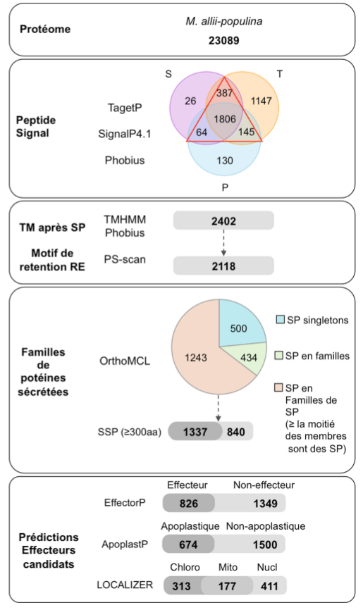
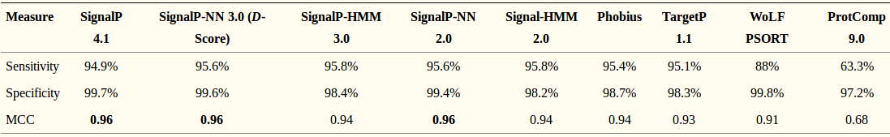
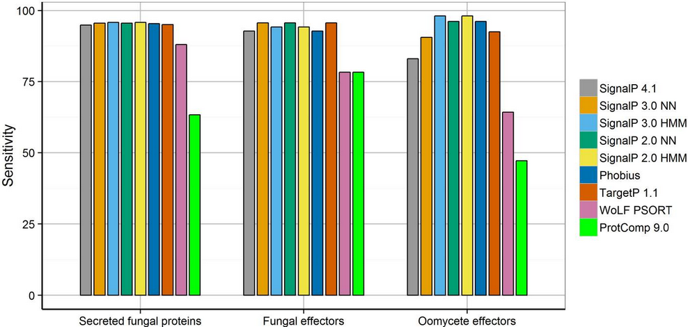

```{r include=FALSE, echo=FALSE, eval=TRUE}
library(knitr)
options(width=300)
knitr::opts_chunk$set(
  fig.width = 13, fig.height = 8, 
  fig.path='figures',
  fig.align = "center", 
  size = "tiny", 
  echo = FALSE, eval=TRUE, 
  warning = FALSE, message = FALSE, 
  results = TRUE, comment = "")
# knitr::asis_output("\\footnotesize")

```


#Résumé


&nbsp;

> - Assemblage

>> - Outils ABYSS
>> - 67 souches séléctionnées (44 souches des terrasses et 19 souches séquencées par Adel)
>> - 30 souches en cours de séquençage

> - RepeatMasker

>> - 4.67 à 8.18 % des séquences  masquées
>> - Certains scaffolds ne sont constitués que d’éléments répétés


> - Souche disponible pour la suite

>> - 67 souches assemblées
>> - 85 souches de la litterrature
>> - 4 souches PacBio

#Annotation
&nbsp;

> - Braker :

>> - Input :

>>> -  Assemblage au format Fasta
>>> - Alignement de RNAseq sur le genome au format Bam ou fichier gff des introns issus des données RNAseq

> - Annotation :

>> - Création d'un fichier gff des introns :

>>> - Bam2hints :  hints issue de l'alignement des données RNAseq
>>> - Exonerate : hints issues de l'annotation des protéines de la souche 70-15 

#Recherche de protéines sécrétées

&emsp; &emsp; 

&emsp; &emsp; <font size="-1">Figure 1: Pipeline de prédiction du secretome de Cecile Lorrain </font> 


#Comparaison outils

&nbsp;


<font size="-1";>Tableau 1: Performance of secretion prediction tools applied to secreted fungal proteins sourced from SwissProt. Table issue de <span>*Evaluation of secretion prediction highlights differing approaches needed for oomycete and fungal effectors*</span> [1] </font> 

&nbsp;

&nbsp;

&nbsp;

<font size="3">[1] Sperschneider J, Williams AH, Hane JK, Singh KB, Taylor JM. 2015. Evaluation of secretion prediction highlights differing approaches needed for oomycete and fungal effectors. Front Plant Sci 6:1168. doi:10.3389/fpls.2015.01168. </font> 

#Comparaison outils (suite)

&nbsp;




<span style="line-height:4pt;font-size: 10pt";>Tableau 2: Sensitivity of secretion prediction tools for secreted fungal proteins, fungal effectors, and oomycete effectors. Table issue de *Evaluation of secretion prediction highlights differing approaches needed for oomycete and fungal effectors* [1]</span>

&nbsp;

&nbsp;

&nbsp;

<font size="3">[1] Sperschneider J, Williams AH, Hane JK, Singh KB, Taylor JM. 2015. Evaluation of secretion prediction highlights differing approaches needed for oomycete and fungal effectors. Front Plant Sci 6:1168. doi:10.3389/fpls.2015.01168. </font> 


#Fin


