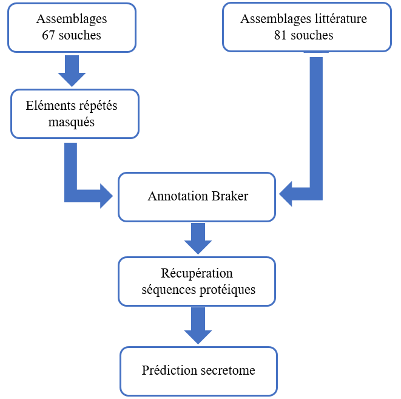
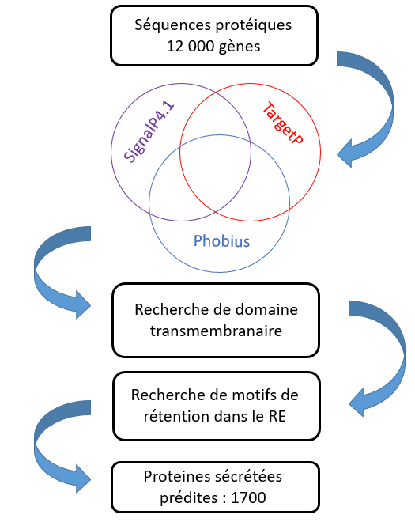

```{r include=FALSE, echo=FALSE, eval=TRUE}
library(knitr)
options(width=300)
knitr::opts_chunk$set(
  fig.width = 10, fig.height = 6, 
  fig.path='figures',
  fig.align = "center", 
  size = "tiny", 
  echo = FALSE, eval=TRUE, 
  warning = FALSE, message = FALSE, 
  results = TRUE, comment = "")
# knitr::asis_output("\\footnotesize")

```

#Présentation du sujet 

#Schéma résumé 

&nbsp;

<center></center>

#Selection des assemblages

#N50

&nbsp;

> - <span style="line-height:4pt;font-size: 15pt";>N50 : la somme des longueurs de tous les contigs de taille égale ou supérieur au N50 couvrent au moins 50% du génome.</span>

&nbsp;


```{r, echo=FALSE, out.height="80%"}

########### Traitement des données #################
dataQuality <-c()
WD <- '/home/charriat/Documents/stage/StatQuality'
file.quality <- file.path(WD,'allStatQuality')
dataQ <- read.table(file=file.quality, sep="\t", header=TRUE)
idS <- c()
idSouche <- c()
for (i in 1:nrow(dataQ))
{
  idS<- toString(dataQ[i,11])
  idSouche <- c(idSouche,substr(idS,0,9))
}
dataQ[,11] <- idSouche
dataQuality <-dataQ[,1:10]
rownames(dataQuality) <- idSouche
kmère <- c(20,30,40,50,60,70,80,90)
Id <- c()
j <- 1
N50 <- data.frame(matrix(NA,ncol=length(kmère),nrow = (nrow(dataQuality)/8)))
for (i in 1:(nrow(dataQuality)/8))
{
  Ids <- rownames(dataQuality[i*8,])
  Id <- c(Id,substr(Ids,0,6))
  N50[i,] <- dataQuality[j:(i*8),6]
  j <- i*8+1
}
rownames(N50) <- Id
colnames(N50) <- kmère

################ Selection ############################
selection <- data.frame(matrix(NA,ncol= ncol(dataQuality) ,nrow = (nrow(dataQuality)/8)))
id.select <- c()
for (i in 1:nrow(N50))
{
  bestKmer <- colnames(N50[i,])[which(N50[i,] == max(N50[i,]), arr.ind = TRUE)[2]]
  newId <- paste(rownames(N50[i,]),toString(bestKmer),sep = '_')
  id.select <- c(id.select,newId)
  selection[i,] <-  dataQuality[rownames(dataQuality) == newId,]

}
colnames(selection) <- colnames(dataQuality)
rownames(selection) <- id.select
x.kmère <- c()
for (i in 1:(nrow(dataQ)/8))
{
  x.kmère <- c(x.kmère,rep(i,8))
}
select.kmère <- c()
for (i in 1:nrow(dataQuality))
{
  if (rownames(dataQuality[i,]) %in% id.select)
  {
    select.kmère <- c(select.kmère, TRUE)
  }
  else 
  {
    select.kmère <- c(select.kmère, FALSE)
  }
}

######## Affichage plot #########

plot(x = x.kmère, y = dataQuality$N50,ylab ='N50',xlab = 'souche',xaxt="n", main ='Graphique n°1 : Assemblage de chaque souche \nen fonction du N50', cex = 0.3)
axis(side = 1,at = 1:length(Id), labels = Id, las =2, cex.axis = 0.6)
points(x = x.kmère[select.kmère], y = dataQuality$E.size[select.kmère], cex = 0.4, col = 'red')

```

#L50

&nbsp;

> - <span style="line-height:4pt;font-size: 15pt";>L50 : le plus petit nombre de contigs qui couvrent 50% du génome.</span>

&nbsp;

```{r}
plot(x = x.kmère, y = dataQuality$L50, ylab ='L50', xlab = 'souche', xaxt="n" , main ='Graphique n°2 : Assemblage de chaque souche \nen fonction du L50', cex = 0.3)
axis(side = 1,at = 1:length(Id), labels = Id, las =2, cex.axis = 0.6)
points(x = x.kmère[select.kmère], y = dataQuality$L50[select.kmère], cex = 0.3, col = 'red')
```

#n:500

&nbsp;

> - <span style="line-height:4pt;font-size: 15pt";>Le nombre de séquence de plus de 500 nucléotides</span>

&nbsp;


```{r}
plot(x = x.kmère, y = dataQuality$n.500,ylab ='n.500',xlab = 'souche', xaxt="n" , main ='Graphique n°3 : Assemblage de chaque souche \nen fonction du nombre de contigs supérieur à 500', cex = 0.3)
axis(side = 1,at = 1:length(Id), labels = Id, las =2, cex.axis = 0.6)
points(x = x.kmère[select.kmère], y = dataQuality$n.500[select.kmère], cex = 0.4, col = 'red')
```

#max 

&nbsp;

> - <span style="line-height:4pt;font-size: 15pt";>La plus grande longueur de scaffold.</span>

&nbsp;


```{r}
plot(x = x.kmère, y = dataQuality$max,ylab ='max',xlab = 'souche', xaxt="n" , main ='Graphique n°4 : Assemblage de chaque souche \nen fonction de la longueur max des contigs', cex = 0.3)
axis(side = 1,at = 1:length(Id), labels = Id, las =2, cex.axis = 0.6)
points(x = x.kmère[select.kmère], y = dataQuality$max[select.kmère], cex = 0.4, col = 'red')
```

#Présentation Qualité littérature

&nbsp;

&nbsp;

```{r Importation des données}
dataQuality <-c()
WD <- '/home/charriat/Documents/stage/StatQuality'
file.quality <- file.path(WD,'QualityMbio.txt')
dataQ <- read.table(file=file.quality, sep="\t", header=TRUE)
idS <- c()
idSouche <- c()
for (i in 1:nrow(dataQ))
{
  idS<- toString(dataQ[i,11])
  idSouche <- c(idSouche,substr(idS,0,9))
}

dataQ[,11] <- idSouche
dataQuality <-dataQ[,1:10]
rownames(dataQuality) <- idSouche
x.kmère <- c()
for (i in 1:(nrow(dataQ)))
{
  x.kmère <- c(x.kmère,rep(i))
}
select.kmère <- c()
N50max <- 25000 # Selection des assemblage avec un N50 supérieur à 25 000
plot(x = x.kmère, y = dataQ$N50, ylab ='N50',xlab = 'souche',xaxt="n",main ='Graphique n°1 : Assemblage de chaque souche en fonction du N50', cex = 0.3)
axis(side = 1,at = 1:length(dataQ$name), labels = dataQ$name, las =2, cex.axis = 0.6)
abline(h=N50max,col="red")
```

#Présentation Qualité littérature

&nbsp;

&nbsp;

```{r}
plot(x = x.kmère, y = dataQ$N50, ylab ='N50',xlab = 'souche',xaxt="n" ,ylim=c(100,250000) ,main ='Graphique n°1 : Assemblage de chaque souche en fonction du N50', cex = 0.3)
axis(side = 1,at = 1:length(dataQ$name), labels = dataQ$name, las =2, cex.axis = 0.6)
abline(h=N50max,col="red")
abline(h=75000,col='black')
```


#Les souches assemblées

>>- Magnaporthe oryzae
>>- Magnaporthe grisea (hôte : Digitaria)
>>- Pyricularia pennisetigena (hôte : Pennisetum)

```{r data Terrasses, echo=FALSE}
############################ Assemblage terrasses ###########################################
dataQuality <-c()
WD <- '/home/charriat/Documents/stage/'
file.quality <- file.path(WD,'Informations_Complémentaires.csv')
allData <- read.table(file=file.quality, sep=',', header=TRUE)
```


```{r Barplot proportion hôte}
library(ggplot2)
pie <- ggplot(allData, aes(x=hôte, fill=hôte))+
  geom_bar(width = 1, stat='count', position = position_stack(reverse = TRUE)) +  theme(axis.text.x = element_blank(), axis.ticks = element_blank()) +labs(x='Hôtes', fill ="")
pie <- pie +geom_text(stat = 'count',aes(label=..count..), vjust=-0.3, size=3.5)
pie <- pie + scale_x_discrete(name ="Hôtes",
                    limits=c('Rice','Hordeum','Setaria','Brachiaria','Stenotaphrum','Eleusine','Eragrostis','Triticum','Lolium','Festuca','Bromus','Avena','Mais','Echinichola','Digitaria','Pennisetum')) + scale_fill_discrete(breaks=c('Rice','Hordeum','Setaria','Brachiaria','Stenotaphrum','Eleusine','Eragrostis','Triticum','Lolium','Festuca','Bromus','Avena','Mais','Echinichola','Digitaria','Pennisetum')) 
pie
```
<center><span style="line-height:4pt;font-size: 10pt";>Graphique1 : Représentation de la proportion des hôtes infectés</span></center>

#Pipeline de prédiction du secretome

&nbsp;

<center></center>


